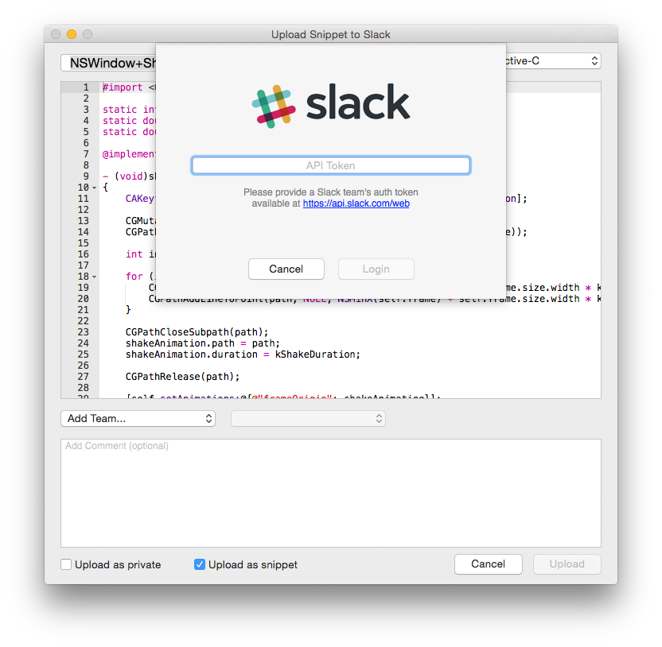
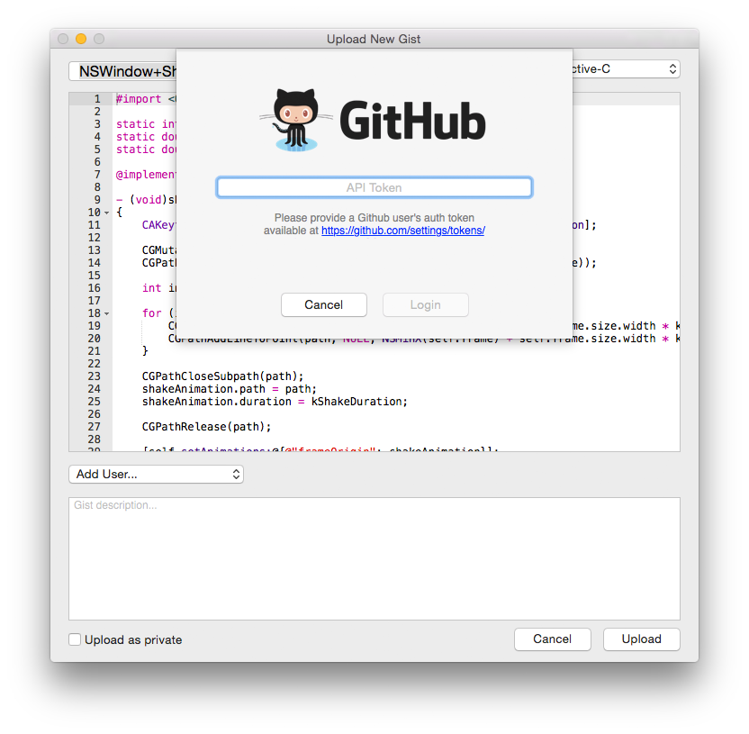

#XCSnippetr

Share code snippets to Slack and Gist without leaving Xcode ever again! 😱

## Features

- Upload code snippets using Slack's and Github's APIs.
- The plugin is available from the code editor's contextual menu.
- Extremely easy to sign-in using your API tokens. Your tokens are secure 🙈, stored in the system's Keychain.
- Add an initial comment (optional).
- Code syntax highlight, thanks to [ACEView](https://github.com/faceleg/ACEView).
- Auto-detection of the source file name, used as the snippet title by default.
- Auto-detection of the source code type. No Swift support for now 😔.
- After upload, copies snippet's url to pasteboard.

Slack only:
- Share to any of your teams, channels, groups and users.
- Upload as a file snippet or as a message with fenced code block.
- Upload as a private file or private message to Slackbot.
- Team's channels are cached during your Xcode session.
- Add as many teams as you want.

Gist only:
- Upload private gists

## How to use

Select any code snippet you would like to share and right click on it.

The first time, you will be prompt to authenticate.

For Slack, use your API tokens available at https://api.slack.com/web

For Gist, generate API tokens at [https://github.com/settings/tokens/](https://github.com/settings/tokens/new?description=xcsnippetr&scopes=gist)

You should be ready to go now.
Simply pick the team and channel to share to. Add a comment. Share! 💥

## Install

Install through [Alcatraz](http://alcatraz.io/), the package manager for Xcode.

Alternatively, clone the repo:

1. Build the project to install the plugin. The plugin will be installed in `~/Library/Application Support/Developer/Shared/Xcode/Plug-ins/XCSwiftr.xcplugin`.

3. Restart Xcode so the plugin bundle is loaded.

## License
(The MIT License)

Copyright (c) 2016 Ignacio Romero Zurbuchen <iromero@dzen.cl>

Permission is hereby granted, free of charge, to any person obtaining a copy of this software and associated documentation files (the 'Software'), to deal in the Software without restriction, including without limitation the rights to use, copy, modify, merge, publish, distribute, sublicense, and/or sell copies of the Software, and to permit persons to whom the Software is furnished to do so, subject to the following conditions:

The above copyright notice and this permission notice shall be included in all copies or substantial portions of the Software.

THE SOFTWARE IS PROVIDED 'AS IS', WITHOUT WARRANTY OF ANY KIND, EXPRESS OR IMPLIED, INCLUDING BUT NOT LIMITED TO THE WARRANTIES OF MERCHANTABILITY, FITNESS FOR A PARTICULAR PURPOSE AND NONINFRINGEMENT. IN NO EVENT SHALL THE AUTHORS OR COPYRIGHT HOLDERS BE LIABLE FOR ANY CLAIM, DAMAGES OR OTHER LIABILITY, WHETHER IN AN ACTION OF CONTRACT, TORT OR OTHERWISE, ARISING FROM, OUT OF OR IN CONNECTION WITH THE SOFTWARE OR THE USE OR OTHER DEALINGS IN THE SOFTWARE.
